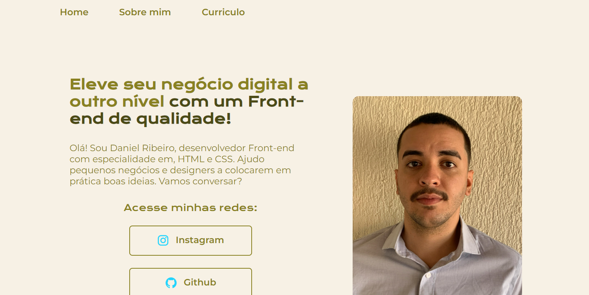

# Portfólio Online
## Olá, Bem vindo ao meu primeiro projeto no GitHub.

Este é um simples portfólio criado para exibir minhas habilidades e experiências em três páginas. Nele, você encontrará informações sobre minha formação acadêmica, habilidades técnicas e experiência profissional.

## 📁 Acesso ao projeto
Voce pode acessar o projeto atraves [deste link](https://portfolio-daniel-one.vercel.app/) ou baixar seu código

## Ferramentas utilizadas:

- ``HTML``

- ``CSS``

## Feito por Daniel Ribeiro

### Linkedin: https://www.linkedin.com/in/daniel-ribeiro-soares98/
